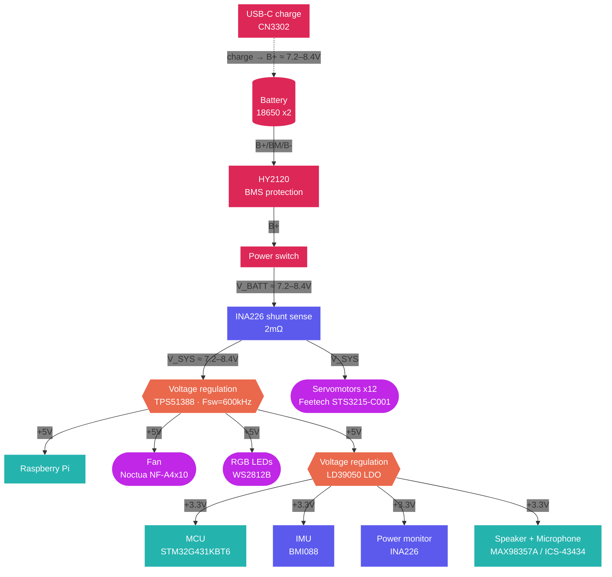
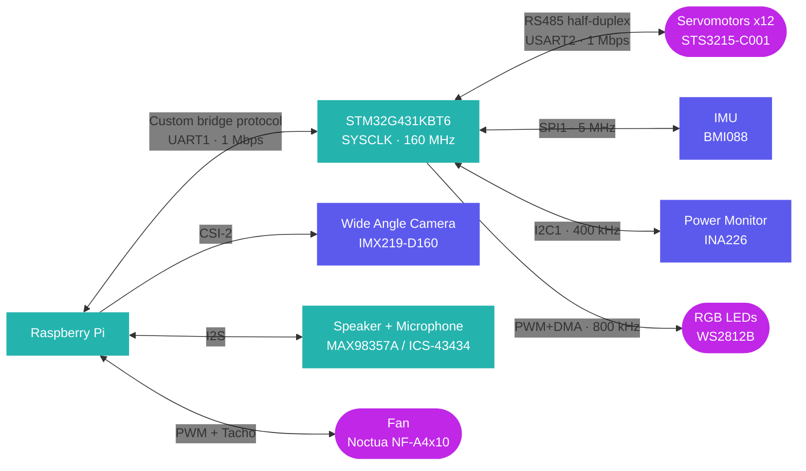

# chromapi_motherboard

This repo contains a dedicated control HAT designed to manage the high-speed motion, power distribution, and sensor integration required for the quadruped robot [Chromapi](https://github.com/Mowibox/chromapi).

  

*Designed with KiCAD 10.*

## Table of contents

| Section | Description |
| --- | --- |
| [Project overview](https://www.google.com/search?q=%23project-overview) | General description of the quadruped control board |
| [Authors](https://www.google.com/search?q=%23authors) | Main contributors information |
| [Sponsors & Acknowledgements](https://www.google.com/search?q=%23sponsors--acknowledgements) | Information about project sponsors and hardware support |
| [Resources & Documentation](https://www.google.com/search?q=%23resources--documentation) | Links to datasheets, BOM, and design architectures |
| [Contributions](https://www.google.com/search?q=%23contributions) | How to contribute to the repository |
| [License](https://www.google.com/search?q=%23license) | Licensing information |

## Project overview

| Resource | Description | Location | Status |
| :--- | :--- | :--- | :--- |
| **💻 Firmware** | STM32 low-level drivers and communication protocol. | [`/firmware`](./firmware) | **Available** |
| **📐 Schematics** | PDF for hardware architecture | [`/hardware/schematic_pdf`](./hardware/schematic_pdf/chromapi_motherboard_v1.pdf) | **Available** |
| **📦 Manufacturing** | Gerbers, Drill files, BOM, and CPL for assembly. | [`/hardware/production`](./hardware/production/) | **Available** |

### Chromapi's Anatomy

* **🧠 The Brain**: The STM32G431KBT6 MCU handles real-time tasks: servo control, IMU fusion, and power monitoring. The Raspberry Pi runs high-level control, vision, and the Python SDK. They communicate through a custom UART bridge at 1 Mbps.

* **💪 The Muscles**: The SN74LVC1G126 and SN74LVC1G125 buffer the half-duplex RS485 bus for 12 Feetech STS3215 servos. The STM32 polls servo positions at 200 Hz.

* **❤️ The Heart**: The TPS51388 converts the 18650 2S battery voltage to 5V. The LD39050 generates the 3.3V rail. The INA226 monitors voltage, current, and power via I2C.

* **🛡️ The Immune System**: The CN3302 charges the two 18650 Li-ion cells through USB-C. The HY2120 provides protection against over-discharge, over-current, and short circuits.

* **👁️ The Senses & Balance**: The BMI088 IMU gives acceleration and angular velocity data with SPI. A Mahony filter runs at 100 Hz and outputs orientation as a quaternion. Four foot switches detect ground contact for gait timing.

* **🗣️ The Voice & Expression**: The MAX98357A drives the speaker via I2S communication. The ICS-43434 microphone captures audio through I2S. And the SN74AHCT1G125 level-shifts the 3.3V signal to 5V for the WS2812B RGB LEDs.

## Authors

| |
| :---: |
|  |
| [**Ousmane THIONGANE**](https://mowibox.github.io) |

## Sponsors & Acknowledgements

The hardware development of this board relies on the resources provided by the sponsors below.

### PCBWay

**[PCBWay](https://www.pcbway.com)** is a global manufacturer specializing in rapid prototyping and low-volume hardware production, offering advanced PCB fabrication, turnkey assembly, CNC machining, and 3D printing.

  

For this project, I utilized their sponsored [PCB manufacturing](https://www.pcbway.com/orderonline.aspx) and [assembly](https://www.pcbway.fr/pcb-assembly.html) (PCBA) services. Beyond fast production, their engineering team excels at detailed file reviews by cross-checking design options, BOMs, and footprints to prevent errors early. Their reliable component sourcing and rigorous verification were of great help in building a high-quality prototype for the Chromapi's motherbard.

---

> Huge thanks to all the hardware folks who reviewed my schematics, or gave me layout tips. I really appreciate your time and support!

## Resources & Documentation

| **⚡ Electrical Specs** | **📄 Bill of Materials** | **📡 Protocol Reference** | **🧠 Software Architecture** |
| :---: | :---: | :---: | :---: |
| Operating voltages, current limits, and thermal ratings. | Detailed BOM with part numbers and unit costs. | Custom UART protocol between RPi and STM32. | Firmware logic, DMA streams, and interrupt priorities. |
| 👉 [**View Specs**]() | 👉 [**View BOM**]() | 👉 [**View Protocol**]() | 👉 [**View Architecture**]() |

### Power Architecture

### Communication Architecture

## Contributions

Contributions are always welcome!

* **Report Issues:** Found an error or have a feature request? Create a new issue [here.](https://github.com/Mowibox/chromapi_motherboard/issues/new/choose)
* **Fix Bugs & Add Features:** Find out where you can lend a hand by checking out [existing issues.](https://github.com/Mowibox/chromapi_motherboard/issues)

## License

This project is licensed under the Apache 2.0 License. See the [LICENSE](https://github.com/Mowibox/chromapi_motherboard/blob/main/LICENSE) file for more details.
